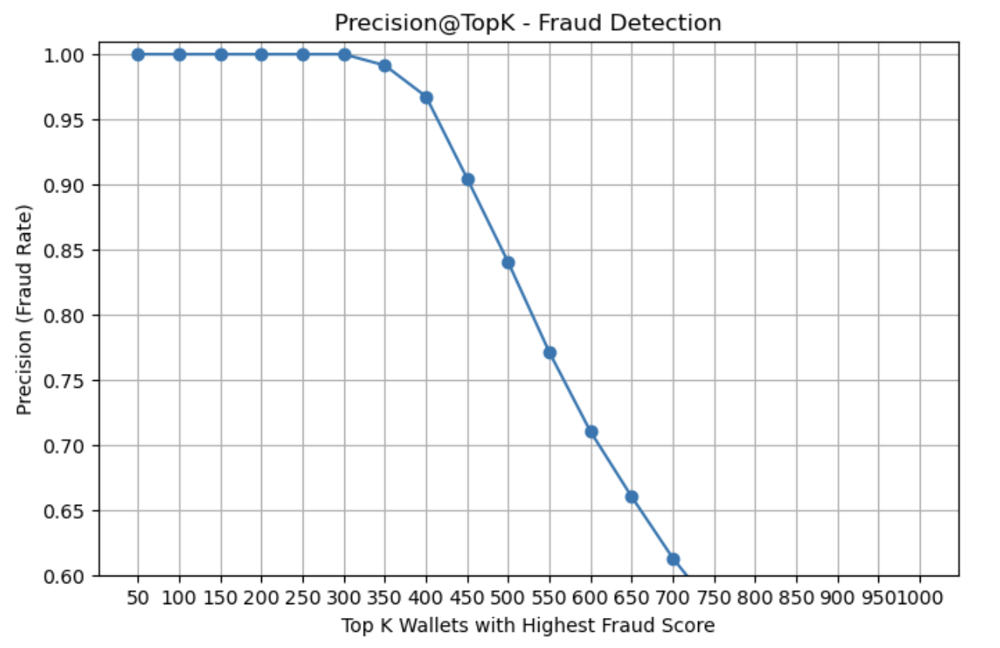

# Ethereum Wallet Fraud Detection with XGBoost

This project applies machine learning to detect fraudulent Ethereum wallets based on their transaction behavior. It uses real-world, imbalanced data to help prioritize suspicious wallets for fraud investigation teams.

---

## Project Highlights

- Built a classification model on Ethereum wallet-level features
- Tackled **imbalanced data** with weighted models and appropriate evaluation metrics
- Compared multiple algorithms: Logistic Regression, Random Forest, XGBoost
- Used **Precision@TopK** to simulate real-world business impact

---

## Problem Statement

Fraudulent activity on the blockchain is hard to detect due to large volume and subtle behavioral patterns. Our goal is:

> To build a supervised ML model that assigns a fraud score to each wallet, enabling fraud teams to focus manual reviews on the most suspicious cases.

The dataset includes pre-aggregated features per wallet, such as:
- Number of transactions sent/received
- Timing gaps between transactions
- ERC20 token transfer values
- Token diversity and contract creation behavior

The target label `FLAG` = 1 denotes fraudulent wallets.

---

## Dataset

- Source: Kaggle [Ethereum Fraud Detection Dataset](https://www.kaggle.com/datasets/vagifa/ethereum-fraud-detection)
- Rows: ~13,000 wallets
- Imbalanced label distribution (fraud ≈ 13%)

---

## Tools & Technologies

- **Language:** Python 3
- **Libraries:** Pandas, Scikit-learn, XGBoost, Matplotlib, Seaborn
- **Notebook:** Jupyter

---

## Model Comparison

Three models were trained using **5-fold cross-validation**, evaluated based on **F1-score** to balance precision and recall:

| Model               | Average F1-score |
|--------------------|------------------|
| Logistic Regression| 0.386            |
| Random Forest      | 0.902            |
| XGBoost            | **0.929**        |

XGBoost was chosen as the final model due to its superior performance under imbalance.

### Evaluation Metric: Precision@TopK

Instead of just accuracy, we simulate real-world usage:

> What if a fraud team can only review the top 300 wallets ranked by fraud score?

| Top K Wallets | Precision (Fraud Rate) |
|---------------|-------------------------|
| Top 300       | **100%**                |
| Top 500       | 84%                     |
| Top 1000      | 43.6%                   |

### Visualization

---

## Business Value

- **Efficiency**: Reviewing just 15% of wallets catches all known frauds (100% precision @ Top 300)
- **Scalability**: Even up to Top 1000 (50% of data), fraud rate stays useful (43%)
- **Prioritization**: Enables targeted review over random sampling

This makes the model actionable in a real-world fraud ops environment.

---

## Future Improvements

- Add temporal features (time between fraud activity bursts)
- Graph-based wallet relationships (e.g. network centrality)
- Use unsupervised anomaly detection for unseen fraud types

---

## Files

| File | Description |
|------|-------------|
| `notebook.ipynb` | Full modeling pipeline: cleaning, training, evaluation |
| `imgs/` | Folder containing evaluation visualizations |
| `README.md` | Project overview and documentation |

---

## Author

**Chih-Chi (Jocelyn) Kang**  
Data-driven analyst passionate about innovative and interesting stuff for good.

[LinkedIn](https://www.linkedin.com/in/chih-chi-jocelyn-kang-ab9092145/)

